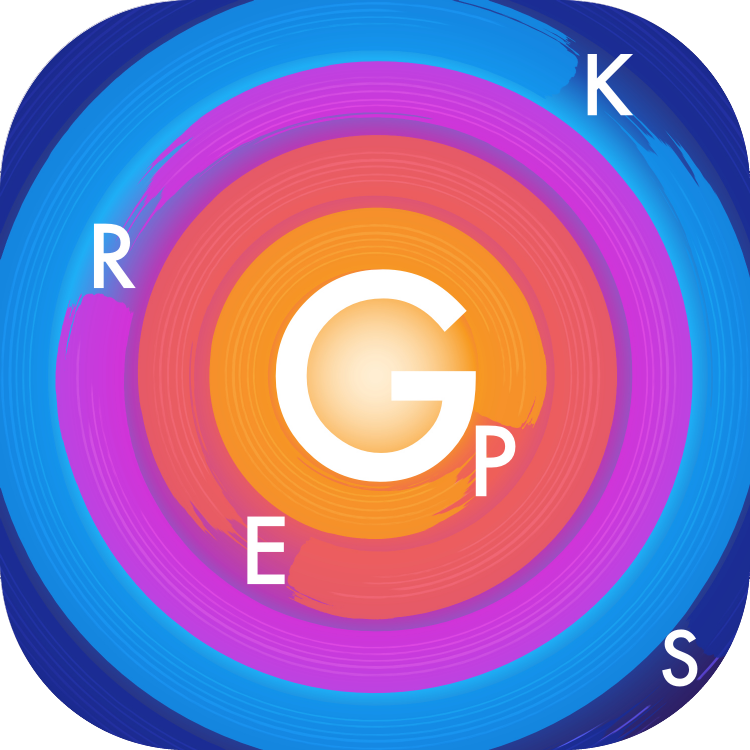

# GPErks

A Python library to (bene)fit Gaussian Process Emulators.

---
## Information

**Status**: `Actively developed`

**Type**: `Personal project`

**Development years**: `2020 - Present`

**Authors**: [stelong](https://github.com/stelong), [ShadowTemplate](https://github.com/ShadowTemplate)

---
## Getting Started

### Prerequisites

* [Python3](https://www.python.org/) (>=3.10)
* [virtualenv](https://pypi.org/project/virtualenv/) (optional)

### Installing

1. Pull the source code from the project repository:
```
git clone https://github.com/stelong/GPErks.git
cd GPErks/
```

2. (optional) Create a Python3 virtual environment:
```
python3 -m venv .venv
source .venv/bin/activate
pip install --upgrade pip setuptools wheel
```

3. (optional) Install the PyTorch package first in order to satisfy your installation requirements. This is especially relevant for CUDA installations, where the specific version needs to match your machine's NVIDIA driver version. For example, for CUDA 11.8:
```
pip install torch --index-url https://download.pytorch.org/whl/cu118
```
Note: for CPU-only installations, you can skip step (3). For CUDA installations, please check the PyTorch [website](https://pytorch.org/get-started/locally/) to choose the correct version.

4. Install GPErks:
```
pip install .
```

5. (optional) Install Jupyter Notebook to be able to run the example notebooks:
```
pip install notebook
```

### Usage

The full documentation is under construction. For the moment, please refer to the example [notebooks](https://github.com/stelong/GPErks/tree/master/notebooks) and [tutorial](https://youtu.be/e4kYIIrcAHA) while noting that this is based on the old GPErks v0.1.0 API (it will still provide a good overview on all package functionalities). The notebooks are also available as plain Python [scripts](https://github.com/stelong/GPErks/tree/master/examples).

---
## Contributing

[stelong](https://github.com/stelong) and [ShadowTemplate](https://github.com/ShadowTemplate) are the only maintainers. Any contribution is welcome!

---
## License

This project is licensed under the MIT license.
Please refer to the [LICENSE](LICENSE) file for more details.

---
*This README.md complies with [this project template](
https://github.com/ShadowTemplate/project-template). Feel free to adopt it
and reuse it.*